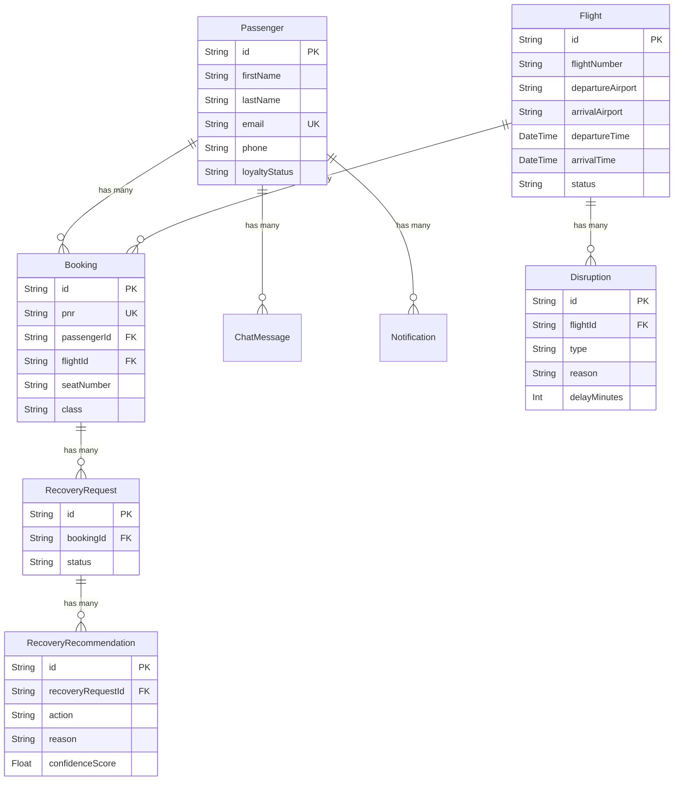

# Sky-Recovery
**Jainam Patel**

---

## Database Design (ER Diagram)

The application follows a normalized relational database schema designed to maintain high data integrity.

```mermaid
erDiagram
    Passenger ||--o{ Booking : "has many"
    Passenger ||--o{ ChatMessage : "has many"
    Passenger ||--o{ Notification : "has many"
    
    Flight ||--o{ Booking : "has many"
    Flight ||--o{ Disruption : "has many"
    
    Booking ||--o{ RecoveryRequest : "has many"
    
    RecoveryRequest ||--o{ RecoveryRecommendation : "has many"

    Passenger {
        String id PK
        String firstName
        String lastName
        String email UK
        String phone
        String loyaltyStatus
    }

    Flight {
        String id PK
        String flightNumber
        String departureAirport
        String arrivalAirport
        DateTime departureTime
        DateTime arrivalTime
        String status
    }

    Booking {
        String id PK
        String pnr UK
        String passengerId FK
        String flightId FK
        String seatNumber
        String class
    }

    Disruption {
        String id PK
        String flightId FK
        String type
        String reason
        Int delayMinutes
    }

    RecoveryRequest {
        String id PK
        String bookingId FK
        String status
    }

    RecoveryRecommendation {
        String id PK
        String recoveryRequestId FK
        String action
        String reason
        Float confidenceScore
    }
```
