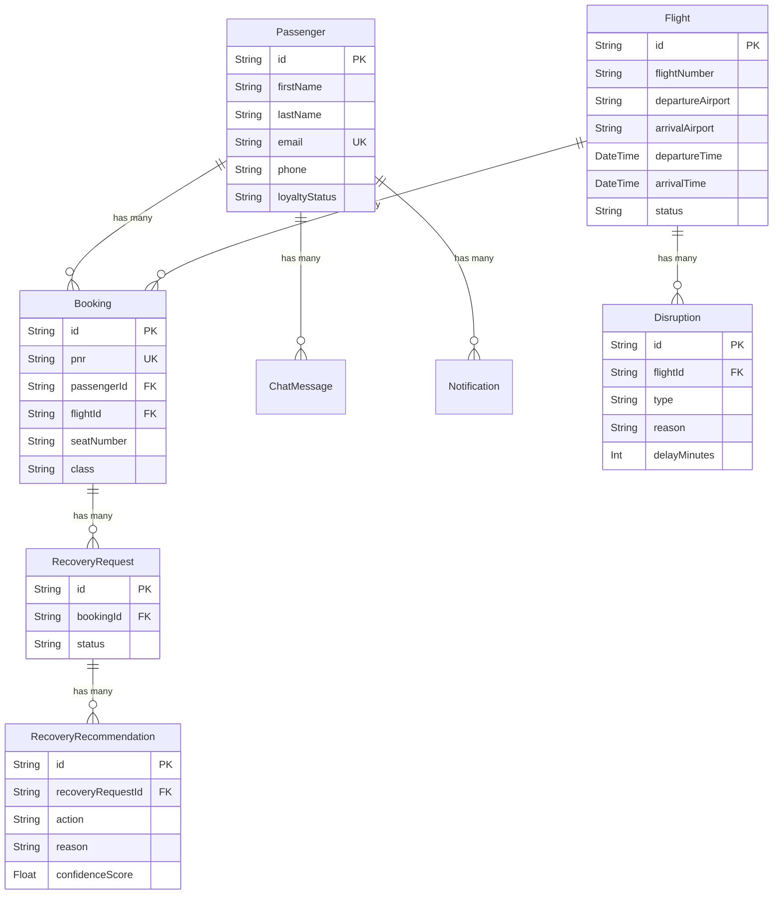

# Sky-Recovery
**Jainam Patel**

---

## Database Design (ER Diagram)

The application follows a normalized relational database schema designed to maintain high data integrity.

### ACID Compliance & Database Practices

The SkyRecover platform is fully **ACID compliant** and follows modern database design principles:

1. **Atomicity & Consistency**: We utilize **Prisma ORM**, which wraps complex database operations (like logging a chat message and retrieving history) in atomic transactions. If a recovery request fails midway, the entire transaction rolls back, preventing orphaned data or partial states.
2. **Referential Integrity (Isolation)**: We enforce strict foreign key constraints at the database level. For example, a `Booking` cannot exist without a valid `Passenger` and `Flight`. Deleting a passenger cascades correctly or gets blocked depending on the foreign key constraints to prevent dangling references.
3. **Durability**: Using SQLite ensures that all committed transactions are persisted immediately to the disk/volume. For production, Prisma trivially allows a switch to PostgreSQL, maintaining identical schema and queries while unlocking distributed durability.
4. **Normalization**: The schema is strictly normalized to 3rd Normal Form (3NF). We avoid data duplication (e.g., flight details are stored in the `Flight` table, not duplicated inside the `Booking` table), which eliminates anomalies during updates.
