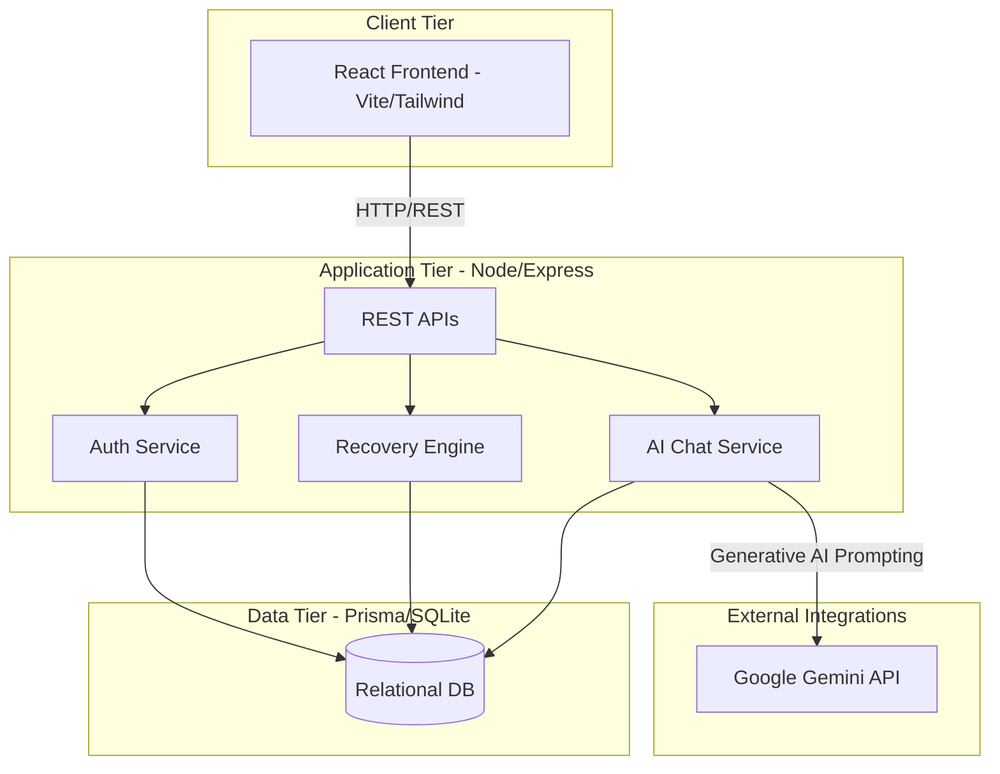

# SkyRecover - Architecture & Solution Design

## 1. Business Understanding
SkyRecover is an automated flight disruption recovery platform designed to address critical challenges in the aviation industry. When flights are delayed or cancelled, airlines face massive operational bottlenecks and passengers suffer from poor experiences, long queues, and uncertainty. SkyRecover solves this by instantly detecting disruptions and proactively offering passengers personalized, AI-driven recovery options (auto-rebooking, refunds, and vouchers) directly on their personal devices, drastically reducing the burden on human customer service agents.

## 2. High-Level Architecture

### Components & Integrations
- **Frontend**: A responsive React SPA built with Vite and TailwindCSS. Features dynamic user journeys, theming, and real-time state updates.
- **Backend**: Node.js and Express server providing stateless REST APIs.
- **Database**: SQLite database managed by Prisma ORM, containing schemas for Passengers, Bookings, Flights, and Chat History.
- **AI Agent**: Integration with the Google Gemini API to power a 24/7 specialized flight recovery chatbot.

## 3. Customer Journey & Workflow
1. **Disruption Detection**: The system identifies a flight status change (e.g., CANCELLED).
2. **Notification**: The passenger logs in and is immediately presented with a Welcome Modal explaining the disruption.
3. **Analysis**: The Recovery Engine analyzes available alternatives, loyalty tiers, and airline policies.
4. **Recommendation Presentation**: The passenger is shown a personalized dashboard with their optimal rebooking option, eligible vouchers (meal/hotel), and compensation.
5. **Decision**: The passenger can choose to "Request Reschedule", "Request Refund", or chat with the AI Agent for more complex queries.
6. **Fulfillment**: The system updates the booking status to "Pending" (simulating a real-world admin approval queue) and notifies the passenger.

## 4. Design Decisions & Trade-offs
- **Monorepo Structure**: Frontend and backend are kept in the same repository for ease of review and rapid full-stack iteration.
- **Prisma + SQLite**: Chosen for zero-config database setup to ensure the evaluation committee can easily run the project locally. Trade-off: SQLite lacks the concurrent write performance of a distributed database, but Prisma makes migrating to PostgreSQL trivial for production.
- **Uncontrolled Joyride Tour**: The UI tour relies on the library's internal state management rather than React state to prevent race conditions when DOM elements mount dynamically.

## 5. Assumptions
- **Simulated PSS**: Real-world airline Passenger Service Systems (PSS) are highly complex and legacy-bound. This project assumes a modernized, simplified relational model for flights and bookings.
- **Deterministic Policies**: Voucher generation (e.g., meals for >3hr delays) is deterministic and hardcoded based on standard airline compensation frameworks.

## 6. Scalability & Performance
- **Stateless APIs**: The Node.js backend is completely stateless, meaning it can be scaled horizontally behind a load balancer (e.g., AWS ALB).
- **Asset Delivery**: Frontend assets are bundled by Vite and can be distributed globally via a CDN (e.g., Vercel Edge Network).
- **Database Indexing**: Prisma schemas include relational foreign keys that are indexed for fast lookup of passenger bookings.

## 7. Security
- **Secret Management**: All sensitive keys (like the Gemini API Key) are isolated in `.env` variables and explicitly excluded from Git via `.gitignore` to prevent secret leaks and satisfy GitHub push protection rules.
- **CORS & Input Validation**: The backend is configured to accept requests only from trusted origins, with basic validation on API payloads.

## 8. Roadmap & Enhancements
- **Admin Dashboard**: Build a dedicated interface for airline staff to manually review and approve the "Pending" reschedule/refund requests.
- **Live Flight Data**: Integrate with external APIs like FlightAware or OAG for real-time disruption triggers.
- **WebSocket Notifications**: Replace manual dashboard refreshing with real-time push notifications using Socket.io.
